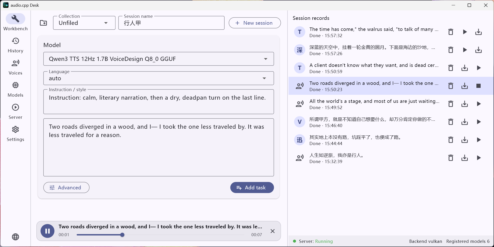

# audio.cpp Desk

English | [简体中文](README.md)

A session-based desktop client for [audio.cpp](https://github.com/0xShug0/audio.cpp): TTS, ASR, a model library with download management, a voice library, sessions & collections, and server control.

> **Third-party client.** audio.cpp itself is **not** bundled with this
> application — obtain it separately. All model weights are downloaded from
> their upstream repositories; each model carries its own license.

## Features

- **Workbench**: text-to-speech (TTS) and speech-to-text (ASR).
- **Model library**: manage and download models, with switchable download
  repositories.
- **Voice library**: manage reference voices for cloning.
- **Sessions & collections**: organize each generation into sessions, and group
  sessions into collections.
- **Server control**: configure and run the audio.cpp server.
- **Bilingual UI** (简体中文 / English).

> Only **TTS / ASR** have been tested so far; other features may be incomplete.

> Model specs library: derived from the official audio.cpp repository and
> documentation, with additions by this project (descriptions, sizes, memory /
> VRAM estimates, etc.).

## Screenshots



## Models tested so far

The main features of the following models have been tested at a basic level:

| Model | Task |
|---|---|
| BreezeTTS 2 | TTS / voice design / clone |
| OmniVoice | TTS / clone / voice design |
| Qwen3-TTS 1.7B Base | TTS / clone |
| Qwen3-TTS 1.7B CustomVoice | TTS (preset voices) |
| Qwen3-TTS 1.7B VoiceDesign | Voice design |
| Qwen3-ASR 1.7B | ASR |

> Other models run through the same generic console but are not yet tested;
> instruction adherence varies by model. Feedback and adaptation requests are
> welcome.

## Requirements

- Windows 10/11 (x64). This project currently targets Windows only.
- Prebuilt release packages bundle the Microsoft Visual C++ runtime, so **no separate
  Visual C++ Redistributable install is required**. (Building from source still needs
  the MSVC toolchain.)
- An **audio.cpp** build: the `audiocpp_server.exe` release directory placed
  under `audio.cpp/<version>/` in the application root. Get it from
  <https://github.com/0xShug0/audio.cpp>.
- The build **must keep its `model_specs/` directory** (`audio.cpp/<version>/model_specs/`):
  the app reads **which models that audio.cpp version supports** from these files,
  so it **stays compatible across backend versions**. Without it, the app cannot
  obtain the model list for that version.

## Build & run (development)

Requires the Flutter SDK (Windows desktop enabled). From the `app/` directory:

```
flutter pub get
flutter run -d windows
```

The application root defaults to the repository root, where `data/`, `models/`
and `audio.cpp/` are created on first run (all git-ignored).

## Package a release

```
package_release.bat
```

Builds a release, assembles the runtime layout, compiles the top-level launcher
(`windows_launcher/launcher.cs`), and writes a ZIP under `dist/`.

The packaged layout:

```
audio_cpp_desk-<version>/
  audio.cpp Desk.exe     launcher (sets the app root, starts bin\audio_cpp_desk.exe)
  bin/                   Flutter program (exe + DLLs + data/flutter_assets)
  data/                  runtime data (created on first run)
  models/                downloaded models (created on first run)
  audio.cpp/             your audio.cpp versions (place builds here; keep model_specs/)
```

## Repository layout

| Path | Purpose |
|---|---|
| `app/` | Flutter desktop application |
| `windows_launcher/` | Native launcher source for the packaged top-level exe |
| `tools/audio2wav/` | Bundled audio transcoder (Media Foundation; compile with `build.bat`) |
| `package_release.bat` | Release packaging script |

## License

Licensed under the Apache License, Version 2.0 — see [LICENSE](LICENSE). See
[NOTICE](NOTICE) for upstream credit (audio.cpp, © ShugoAI LLC).
