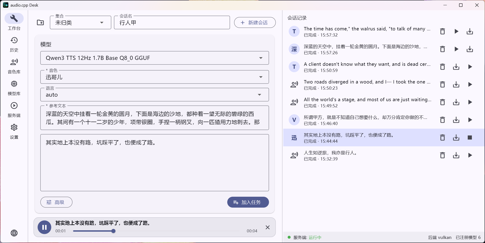

# audio.cpp Desk

简体中文 | [English](README.en.md)

面向 [audio.cpp](https://github.com/0xShug0/audio.cpp) 的**会话式桌面客户端**：TTS、ASR、模型库与下载管理、音色库、会话与集合，以及服务端控制。

> 本软件为第三方客户端，不含 audio.cpp 本体，也不分发模型权重；两者需另行获取并遵循各自许可。

## 功能

- **工作台**：语音合成（TTS）与语音识别（ASR）。
- **模型库**：模型管理与下载，下载仓库可切换。
- **音色库**：管理用于克隆的参考音色。
- **会话与集合**：以会话组织生成记录，并可将会话归入集合。
- **服务端控制**：配置并启动 audio.cpp 服务端。
- **中英双语界面**。

> 目前仅测试了 **TTS / ASR**，其它功能可能尚未完善。

> 模型规格库来源：取自官方 audio.cpp 仓库与文档，并由本项目补充（描述、体量、内存 / 显存估算等）。

## 截图



## 目前测试过的模型

以下模型的主要功能已做过基础测试：

| 模型 | 任务 |
|---|---|
| BreezeTTS 2 | TTS / 语音设计 / 克隆 |
| OmniVoice | TTS / 克隆 / 语音设计 |
| Qwen3-TTS 1.7B Base | TTS / 克隆 |
| Qwen3-TTS 1.7B CustomVoice | TTS（预置音色） |
| Qwen3-TTS 1.7B VoiceDesign | 语音设计 |
| Qwen3-ASR 1.7B | ASR |

> 其它模型走同一套通用控制台，但**尚未测试**；不同模型对指令的遵循程度不一。**欢迎反馈，也欢迎提出适配需求。**

## 环境要求

- Windows 10/11（x64）。当前仅面向 Windows。
- 预编译的发布包已自带 Microsoft Visual C++ 运行库，**无需单独安装 VC++ Redistributable**。
  （从源码构建仍需 MSVC 工具链。）
- 一份 **audio.cpp** 构建：把含 `audiocpp_server.exe` 的版本目录放到应用根目录下的
  `audio.cpp/<版本>/`。获取地址：<https://github.com/0xShug0/audio.cpp>。
- 构建里**必须保留 `model_specs/` 目录**（`audio.cpp/<版本>/model_specs/`）：应用通过它
  获知**该版本 audio.cpp 支持哪些模型**，从而**兼容不同版本的后端**。缺少它，将无法
  获取该版本支持的模型列表。

## 构建与运行（开发）

需要 Flutter SDK（启用 Windows 桌面）。在 `app/` 目录下：

```
flutter pub get
flutter run -d windows
```

应用根目录默认为仓库根目录，首次运行会在其中创建 `data/`、`models/`、`audio.cpp/`
（均已在 gitignore 中）。

## 打包发布

```
package_release.bat
```

会构建 release、组装运行布局、编译顶层启动器（`windows_launcher/launcher.cs`），
并在 `dist/` 下生成 ZIP。

打包后的目录结构：

```
audio_cpp_desk-<版本>/
  audio.cpp Desk.exe     启动器（设置应用根目录，再启动 bin\audio_cpp_desk.exe）
  bin/                   Flutter 程序（exe + DLL + data/flutter_assets）
  data/                  运行期数据（首次运行创建）
  models/                已下载模型（首次运行创建）
  audio.cpp/             你的 audio.cpp 版本（把构建放这里，保留 model_specs/）
```

## 目录结构

| 路径 | 说明 |
|---|---|
| `app/` | Flutter 桌面应用 |
| `windows_launcher/` | 打包后顶层 exe 的原生启动器源码 |
| `tools/audio2wav/` | 自编音频转码器（Media Foundation；用 `build.bat` 编译） |
| `package_release.bat` | 发布打包脚本 |

## 许可

本项目采用 Apache License 2.0 许可——见 [LICENSE](LICENSE)。上游致谢见
[NOTICE](NOTICE)（audio.cpp，© ShugoAI LLC）。
